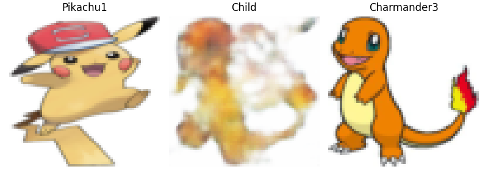

# Report

### Project Overview
Pokéfam allows users to select two “parent” Pokémon, and it will generate a hybrid “child” Pokémon that contains features of the parents.
The dataset I’m using contains multiple versions of each Pokémon, so my project takes in user arguments that specify which Pokémon version to use. I’m using a convolutional VAE and training on a set of around 2,500 images. The encoder compresses the images into latent space, performs interpolation to calculate a blend between the latent representations of the parents, and then the decoder reconstructs this data into a new “child” Pokémon image.

Here are a few sample images (These are also some in the `samples` folder):





As seen above, the child images are not great. VAEs are usually blurry and do not produce the best quality, but I can make out features of both Pokémon in the hybrid image. It’s more like the essence of the Pokemon than a true hybrid generation, but I was pleased to see that I could at least make out shapes and colors from both parents. I do think it worked better on Pokemon that had similar shapes.

### Extra Criteria
I chose to do the creative latent space exploration for my extra criteria. I do this by encoding both parent Pokémon into the latent space using the encoder, then computing a weighted midpoint between their latent coordinates. Using a KL divergence penalty in the loss function regularizes the latent space to be smooth and mostly normal, so it is continuous and the space between the encodings contain points that the decoder can use for generation of new hybrid images.  

### Difficulties
My main difficulty with this project was determining the best architecture and training my ConvVAE. Initially, I was using a fully connected linear VAE and it led to very blurry images. It’s possible I just hadn’t given enough epochs for training, but I saw online that a ConvVAE was typically better for image generation and larger inputs like the 64x64x3 images that I was using, so I switched before I spent too much time on training. 
My next difficulty was with my loss function. I ended up changing this a lot because I wasn’t exactly sure the best way to measure this. I started out with binary cross entropy for my reconstruction loss, but it was one of the many changes I made while fiddling with my model and hyperparameters. Since MSE compares generated images with the original pixel-by-pixel, I thought that it would be better in helping generate hybrids that have features that look like the parents. However, after changing to MSE, I think my loss still wasn’t scaled properly, because I was still getting blurry outputs where I couldn’t make out any detail. I divided both my reconstruction loss and KL divergence loss by the batch size. Determining the KL weight also required some more time. I first made it really small, but after increasing it to 0.1, I noticed a huge improvement in the reconstructed images. 
Training also took quite a bit of time before I added early stopping and realized that my model didn’t actually need so many epochs because my loss was plateauing far earlier than I’d anticipated.


# How to Run

### 1. Install Dependencies
Make sure you have the required libraries installed:
```bash
pip install -r requirements.txt
```

### 2. Generate a Hybrid
Run the `pokefam.py` script with the names of two parent Pokemon. You can find available names in `docs/pokemon_list.md` or the `data/images` folder (use the filename without the extension).

```bash
python pokefam.py <parent1> <parent2>
```

**Example:**
```bash
python pokefam.py pikachu0 charmander1
```

The resulting image will be saved in the root directory as `hybrid_<parent1>_<parent2>.png`.

### 3. Training (Optional)
If you want to train the model yourself, you can run:
```bash
python poketrain.py
```
*A pre-trained model (`vae_model.pth`) is already included.*
